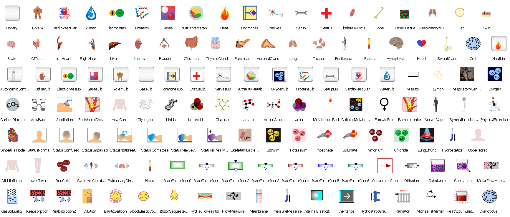

# Bodylight.mo

Bodylight library is a fork of Physiolibrary, version 2.4.1 ( http://www.physiolibrary.org ) and is a free open-source Modelica library designed for compartmental modeling of human physiology.
This library contains basic physical laws governing human physiology, usable for cardiovascular circulation,
metabolic processes, nutrient distribution, thermoregulation, gases transport, electrolyte regulation,
water distribution, hormonal regulation and pharmacological regulation.

## Library description

The origin of the Modelica Physiolibrary, a Bodylight predecessor, was in the initial version of our Physiomodel ( http://www.physiomodel.org ) implementation, which is based on model of human physiology called HumMod. As the successors of Guyton's Medical Physiology School write, the original HumMod model is “The best, most complete, mathematical model of human physiology ever created” ( http://hummod.org ).

We are also developing many types of smaller physiological models for use in medical education,
so it was essential to separate this library from our HumMod Modelica implementation. This separation improves
the quality of the next HumMod release and provides a useful Modelica library to modelers in this bioscience.
The library contains only carefully-chosen elementary physiological laws, which are the basis of more complex physiological
processes. For example from only two type of blocks (Chemical.ChemicalReaction and Chemical.Substance) it is
possible to compose the allosteric transitions or the Michaelis-Menten equation.

Library contains also the icons for higher level (HumMod) subsystem implementations:

## Installation
* Bodylight/package.mo can be directly opened by each Modelica environments. 

* Dymola support of physical units:
  * Using Windows batch script: call "Bodylight\Resources\Install\Dymola\install.bat"
  * Manually: copy the Bodylight/Resources/DisplayUnits/displayUnits.mos over dymola-install-dir/insert/displayUnits.mos

## Prerequisities

* environment supporting Modelica 3.2 or higher ([Dymola](http://www.3ds.com/products-services/catia/capabilities/modelica-systems-simulation-info/dymola/trial-version/), [OpenModelica](https://build.openmodelica.org/omc/builds/windows/releases/), 

## Current release

Download [Bodylight.mo](https://github.com/creative-connections/Bodylight.mo)

## Upgrading from Physiolibrary 2.4.x
Use [Bodylight\Resources\Conversions\](https://github.com/creative-connections/Bodylight/Resources/Conversions/UpdatePhysiolibrary2.4ToBodylight1.0.bat) to simply rename Physiolibrary 2.4.x to Bodylight 1.0. Just place this into root of your project and run.

## Release notes

*  Version 1.0 is based on 
[Physiolibrary v2.5 (2021-06-29)](https://github.com/filip-jezek/Physiolibrary/releases/tag/v2.5)

## License (BSD 3-Clause)

Copyright (c) 2008-2025, Marek Mateják, Filip Ježek, Tomáš Kulhánek, Charles University in Prague

All rights reserved. 

Redistribution and use in source and binary forms, with or without modification, are permitted provided that the following conditions are met: 

1. Redistributions of source code must retain the above copyright notice, this list of conditions and the following disclaimer. 
2. Redistributions in binary form must reproduce the above copyright notice, this list of conditions and the following disclaimer in the documentation and/or other materials provided with the distribution. 
3. Neither the name of the copyright holder nor the names of its contributors may be used to endorse or promote products derived from this software without specific prior written permission. 

THIS SOFTWARE IS PROVIDED BY THE COPYRIGHT HOLDERS AND CONTRIBUTORS "AS IS" AND ANY EXPRESS OR IMPLIED WARRANTIES, INCLUDING, BUT NOT LIMITED TO, THE IMPLIED WARRANTIES OF MERCHANTABILITY AND FITNESS FOR A PARTICULAR PURPOSE ARE DISCLAIMED. IN NO EVENT SHALL THE COPYRIGHT HOLDER OR CONTRIBUTORS BE LIABLE FOR ANY DIRECT, INDIRECT, INCIDENTAL, SPECIAL, EXEMPLARY, OR CONSEQUENTIAL DAMAGES (INCLUDING, BUT NOT LIMITED TO, PROCUREMENT OF SUBSTITUTE GOODS OR SERVICES; LOSS OF USE, DATA, OR PROFITS; OR BUSINESS INTERRUPTION) HOWEVER CAUSED AND ON ANY THEORY OF LIABILITY, WHETHER IN CONTRACT, STRICT LIABILITY, OR TORT (INCLUDING NEGLIGENCE OR OTHERWISE) ARISING IN ANY WAY OUT OF THE USE OF THIS SOFTWARE, EVEN IF ADVISED OF THE POSSIBILITY OF SUCH DAMAGE.

## Development and contribution
Release manager: [Filip Ježek](http://github.com/filip-jezek)

Contributor: 
[Marek Mateják](http://github.com/MarekMatejak)
[Tomas Kulhanek] (https://github.com/TomasKulhanek), 
[tbeu] (https://github.com/tbeu)
[Filip-jezek] (https://github.com/filip-jezek)

You may report bugs or issues to [project issues](https://github.com/creative-connections/Bodylight.mo/issues)

